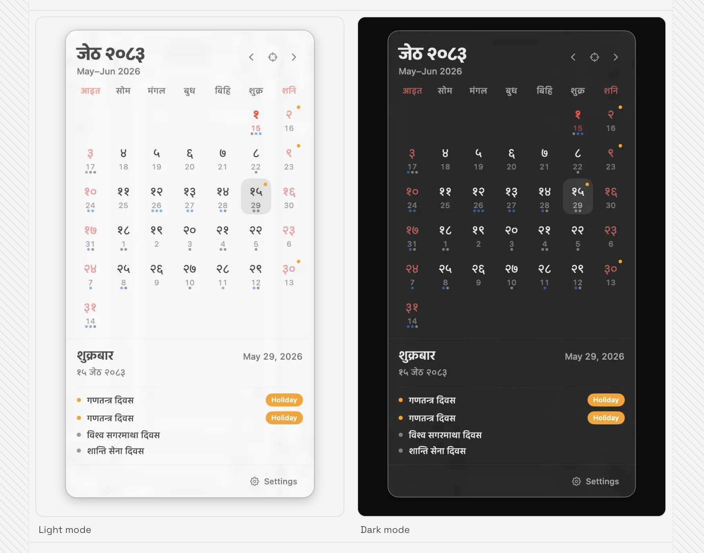

# Nepali Calendar

> Bikram Sambat in your macOS menu bar — festivals, public holidays, and a quiet popover that gets out of the way.

  

Nepali Calendar lives in the menu bar and stays out of the way until you need it. One click brings up today's BS date, the month grid, festivals and observances, and the AD equivalent — without taking over your screen the way a full calendar app does.

## What's inside

- **Bikram Sambat + Gregorian, side by side.** Every cell shows the BS day in large numerals with the AD day as a subdued subscript, so you never have to convert in your head.
- **Festivals and public holidays.** National, religious, regional, cultural, and international entries are pulled in automatically and shown as colored dots on the day; tap a day to see the names with a clear *Holiday* badge for the ones that close offices.
- **Nepali or English labels.** Toggle between Devanagari and Latin via the language switch, or use **⌘L**.
- **Quiet by design.** No notifications, no badges, no constant icon-in-your-face. Just the BS day number on the menu bar and a popover that opens when you click it.
- **Self-healing date state.** After sleep, wake, or a session that crosses midnight, the highlighted day, visible month, and menu bar label all stay in sync.
- **Auto-update built in.** New releases land in the popover as a small banner; one click installs and relaunches. SHA-256 verified, no manual DMG dragging.
- **Light and dark mode** that follows the system, with care taken so today and the selected day stay legible on both surfaces.

## For people who…

- check the BS date several times a day and don't want to open a website or a phone for it.
- want a Nepali calendar that respects the rest of their desktop — no docks, no notifications, no analytics.
- like keyboard shortcuts: **⌘←/⌘→** for months, **⌘T** for today, **⌘L** for language, **⌘,** for settings, **⌘Q** to quit.

## Privacy

No accounts. No analytics SDKs. No tracking scripts. The app stores a small local festival cache and your language preference on your Mac — nothing leaves your machine except the festival fetch and the update check.

[Privacy details →](https://calendar.nabinkhair.com.np/privacy)

## Links

- **Website** — <https://calendar.nabinkhair.com.np>
- **Download** — <https://calendar.nabinkhair.com.np/downloads/NepaliCalendar.dmg>
- **Changelog** — <https://calendar.nabinkhair.com.np/changelog>
- **GitHub releases** — <https://github.com/nabinkhair42/nepali-calendar/releases>

## Requirements

macOS 14 or later. Menu bar access. That's it.
